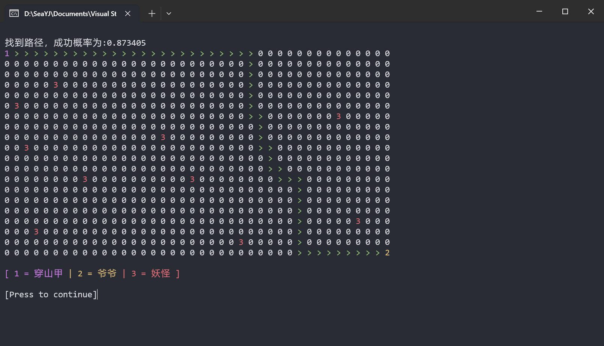

# 🦔 PANGOLINPATHFINDER

## ❓ 问题描述

**拯救爷爷**：穿山甲想要在山里中挖出一条路径，来解救被妖怪囚禁的爷爷。假如穿山甲挖的路径都是在平面内。***妖怪数量和位置***、***爷爷被囚禁的位置***都由用户输入。假如穿山甲挖洞的动静惊动妖怪的概率，与其所处的位置与最近的妖怪距离成反比，现在为穿山甲指出一条成功概率最高的路径，并输出此路径的成功概率值。

## 💻 基础算法

基于 **Dijkstra 算法**实现了一个带权重的最短路径搜索算法，使用优先队列进行搜索，并且在计算路径权重时考虑了路径上每一步的惊动概率。从而找到一个最短的、成功率最高的路径。

## 👁‍🗨 惊动概率的数学模型

1. **每步的惊动概率 Pi**：仍然使用 `Pi = k / d` 的公式，其中 d 是当前节点与最近妖怪的距离，k 是一个常数，用于调整惊动概率的量级，可证 `0 < Pi <= 1/(√2)`。
2. **整条路径的累积惊动概率 P**：采用线性累加的方式计算路径总惊动概率：`P_total = Σ Pi`。为了确保 P_total 在梯度变化合理范围内，引入一个归一化系数 alpha，使得 `P = 1 - exp(-alpha * P_total)`，其中 alpha 可以根据路径长度进行调整。路径成功概率：
3. **成功概率 SuccessProbability**：最后 `SuccessProbability = P`。

## 🕒 程序运行截图

## ➕ 补充

**证明 `0 < Pi <= 1 / √2`**

已知：
`Pi = 1 / (√((Xi - monster.Xi)^2 + (Yi - monster.Yi)^2))`

设 `Ai = √((Xi - monster.Xi)^2 + (Yi - monster.Yi)^2)`、
`Bi = Xi - monster.Xi`、
`Ci = Yi - monster.Yi`。

则 `Pi = 1 / Ai = 1 / (√(Bi^2 + Ci^2))`

因为 `Xi != monster.Xi && Yi != monster.Yi`，
所以 `Bi != 0 && Ci != 0`，
所以 `Ai != 0`，即 `Pi != 0`。
又因为 `Ai > 0`，可得 `Pi > 0`。

因为 `Xi、monster.Xi、Yi、monster.Yi ∈ N` 且 `Xi != monster.Xi && Yi != monster.Yi`，
所以 `Bi、Ci ∈ N+`，
所以 `MIN(Bi) = 1`、`MIN(Ci) = 1`，
所以 `MIN(Bi^2 + Ci^2) = 2`，
所以 `MAX(Pi) = MAX(1 / Ai) = 1 / √2`，
所以 `Pi <= 1 / √2`。

综上，`0 < Pi <= 1 / √2`。
